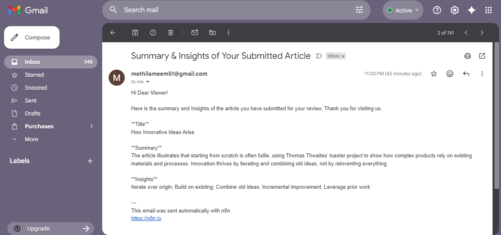

# 🧠 AI Article Processor with n8n

**Automated AI-based article processing system** built using **n8n**, FastAPI, and a front-end for URL submission.  
It takes an article URL and user email, processes the content through an LLM, stores results, and sends a summary via email.

---

## 🚀 Why This Project Matters

Showcases a **real-world automation system** combining:
✔ Web scraping  
✔ LLM-powered summarization & insights  
✔ Workflow automation with **n8n**  
✔ Email automation  
✔ Persistent session tracking and logging

This project demonstrates **end-to-end automation skills** suitable for data engineering, backend automation, and AI-assisted systems engineering.

---

## 📌 Features

- 📥 Frontend form to submit article URL & email  
- 🔄 n8n workflow triggered with session ID  
- 🕸 Article scraping & content extraction  
- 🤖 LLM processing (summary, insights)  
- 📊 Logging to Excel or database  
- 📧 Automatic email delivery with results  

---

## 📦 Tech Stack

| Component | Technology |
|-----------|------------|
| Frontend  | Lovable.dev form |
| Backend   | FastAPI |
| Workflow  | n8n (JSON workflow combined with API triggers) |
| AI LLM    | GPT-based summarization |
| Data store| Excel sheet or sheet API |
| Communication | SMTP email service |

---

## 📈 Workflow Overview

1. **User submits URL + email** via frontend
- Frontend references
  - Git repository link for frontend code using Lovable: https://github.com/Methila-Meem/article-submitter
  - Frontend URL: https://lovable.dev/projects/0ab99550-5364-4667-af3c-078d3fb893bc
  - Frontend view
   
2. Frontend sends to backend **API**
- Backend references
  - Git repository link for backend code using FastAPi: https://github.com/Methila-Meem/Article_Processor_API
  - Backend link hosted in render: https://article-processor-api.onrender.com/
3. Backend triggers an n8n workflow with session ID
4. n8n:
   - Scrapes article body
   - Sends content to LLM for summarization
   - Stores results in Excel or DB
   - Sends summary email
   - Workflow diagram
    
6. User receives summary email

---

## 🛠 Setup & Installation

### Prerequisites

✔ Node.js and n8n installed  
✔ Python & FastAPI environment  
✔ SMTP credentials for mail delivery  
✔ LLM API key (OpenAI or similar)

### 1. Setup Environment
```
cp .env.example .env
```
- Fill in API keys, SMTP config, etc.

### 2. Run Backend
```
pip install -r requirements.txt
uvicorn app.main:app --reload
```

### 3. Import Workflow

- Open n8n

- Go to “Workflows”

- Import n8n/ArticleProcessor.workflow.json

- Fill required credentials

---

## ✨ Demo

📹 Video walkthrough link: https://drive.google.com/file/d/1dJAcyCKrHsnA8NWFqYSS2WIS7TdbK8bA/view?usp=sharing

---

## 🧪 Sample Output

📝 Summary reports & deep insights on article content, automatically generated and emailed.


