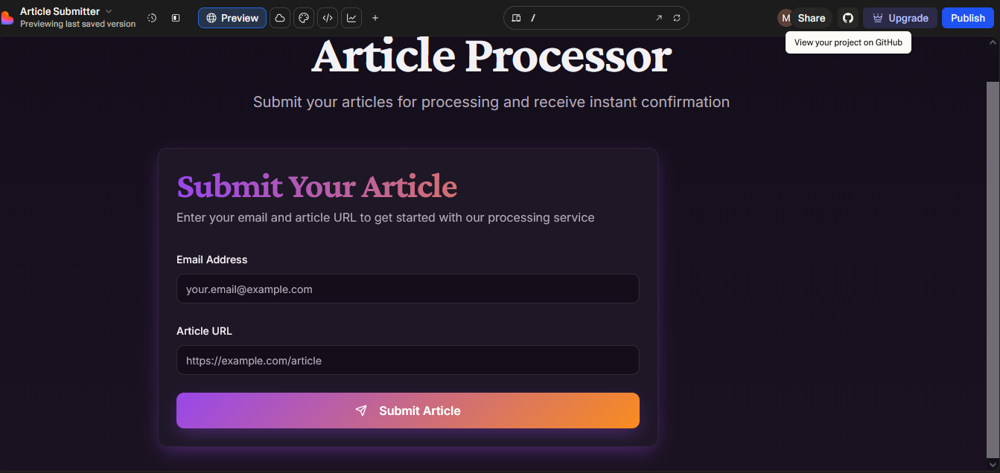
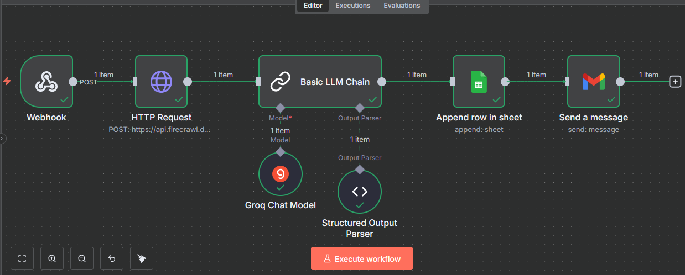

##AI Agent Project with n8n/ Article Processor

🎯 Task Objective: built a mini AI workflow system where the frontend + backend connect to n8n, and n8n handles all article processing.

#Frontend references
- Git repository link for frontend code using Lovable: https://github.com/Methila-Meem/article-submitter
- Frontend URL: https://lovable.dev/projects/0ab99550-5364-4667-af3c-078d3fb893bc
- Frontend view

#Backend references
- Git repository link for backend code using FastAPi: https://github.com/Methila-Meem/Article_Processor_API
- Backend link hosted in render: https://article-processor-api.onrender.com/

#N8N Workflow 
- Workflow diagram

- Video presentation link: https://drive.google.com/file/d/1dJAcyCKrHsnA8NWFqYSS2WIS7TdbK8bA/view?usp=sharing

